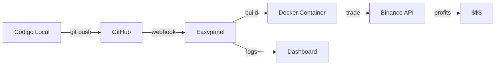

# 🎯 Deployment con Easypanel (RECOMENDADO)

## ✅ Por Qué Easypanel es Perfecto

- 🖱️ **Interfaz visual**: Deploy con clicks, sin terminal
- 🐳 **Docker nativo**: Usa el Dockerfile que ya creamos
- 🔄 **Auto-deploy**: Conecta con GitHub para deploys automáticos
- 📊 **Logs integrados**: Ver logs en tiempo real desde el panel
- 💰 **Gratis**: Solo pagas el VPS ($5-10/mes)
- ⚡ **Rápido**: Deploy en 5 minutos

---

## 🚀 Guía de Deployment (5 Minutos)

### Opción 1: Deploy desde GitHub (Recomendado) 🎯

#### Paso 1: Subir Código a GitHub

```powershell
# En tu PC local
cd C:\Users\guido\OneDrive\G2INNOVATION\TRADING_AUTOMATICO

# Inicializar Git (si no lo has hecho)
git init
git add .
git commit -m "Trading bot inicial"

# Crear repo en GitHub y subir
git remote add origin https://github.com/TU-USUARIO/trading-bot.git
git branch -M main
git push -u origin main
```

**IMPORTANTE**: NO subas el archivo `.env` a GitHub (ya está en `.gitignore`)

#### Paso 2: Crear App en Easypanel

1. **Login a Easypanel**
   - Ir a tu panel: `https://tu-servidor.com`

2. **Create New App**
   - Click "+ New" → "App"
   - Nombre: `trading-bot`

3. **Source**
   - Selecciona "GitHub"
   - Conecta tu cuenta de GitHub
   - Selecciona el repositorio `trading-bot`
   - Branch: `main`

4. **Build**
   - Easypanel detectará automáticamente el `Dockerfile`
   - Build Method: **Dockerfile**
   - Dockerfile: `./Dockerfile`

5. **Environment Variables**
   Agregar estas variables (click "Add Environment Variable"):
   
   ```
   EXCHANGE_API_KEY=xYRBUDX0k7Fu9xV2dFO7SJHIRnlpJ5jlUPS1O8dMOgDBf9xMt0osJAMkmbeym5lC
   EXCHANGE_SECRET=Xl5zoTZbqQ0pGCwZZBeL0yQTaOkiZQj8Xt6J67Nh2Xc1xhA8VDzruxDBZdXl7S5N
   DRY_RUN=true
   INITIAL_CAPITAL=1000
   ```

6. **Deploy**
   - Click "Deploy"
   - Espera 2-3 minutos mientras construye

7. **Ver Logs**
   - Click en la app → "Logs"
   - Verás el bot iniciando y operando en tiempo real

---

### Opción 2: Deploy Manual (Sin GitHub)

Si no quieres usar GitHub:

#### Paso 1: Crear App Vacía

1. En Easypanel: "+ New" → "App"
2. Nombre: `trading-bot`
3. Source: **Docker Image**
4. Image: `python:3.11-slim`

#### Paso 2: Configurar Build

En la sección **Build**, cambiar a:
- Type: **Dockerfile**
- Método: **Inline Dockerfile**

Pegar este Dockerfile:

```dockerfile
FROM python:3.11-slim

WORKDIR /app

RUN apt-get update && apt-get install -y build-essential curl git && \
    rm -rf /var/lib/apt/lists/*

RUN pip install --no-cache-dir freqtrade[all]

# Estos archivos los subirás por SFTP después
COPY user_data /app/user_data

EXPOSE 8080

ENV PYTHONUNBUFFERED=1

CMD ["freqtrade", "trade", "--config", "user_data/config.json", "--strategy", "GridScalpingHybrid"]
```

#### Paso 3: Subir Archivos por SFTP

1. En Easypanel, ir a **Files**
2. Crear carpeta `/app/user_data`
3. Subir:
   - `user_data/strategies/GridScalpingHybrid.py`
   - `user_data/config.json`

4. Agregar variables de entorno (ver Opción 1, Paso 5)

5. Click "Deploy"

---

## 📋 Configuración Completa (Copy-Paste)

### Variables de Entorno para Easypanel

```env
# Exchange API Keys
EXCHANGE_API_KEY=xYRBUDX0k7Fu9xV2dFO7SJHIRnlpJ5jlUPS1O8dMOgDBf9xMt0osJAMkmbeym5lC
EXCHANGE_SECRET=Xl5zoTZbqQ0pGCwZZBeL0yQTaOkiZQj8Xt6J67Nh2Xc1xhA8VDzruxDBZdXl7S5N

# Trading Config
DRY_RUN=true
INITIAL_CAPITAL=1000
MAX_OPEN_TRADES=5
STAKE_AMOUNT=100

# Risk Management
STOP_LOSS_PERCENTAGE=2
TAKE_PROFIT_PERCENTAGE=3
MAX_DAILY_DRAWDOWN=10

# Telegram (Opcional)
# TELEGRAM_TOKEN=tu_token_aqui
# TELEGRAM_CHAT_ID=tu_chat_id_aqui
```

---

## 🔧 Configuración Avanzada

### Persistent Storage (Logs y Datos)

En Easypanel:

1. Ir a **Volumes**
2. Click "Add Volume"
3. Configurar:
   - Name: `bot-data`
   - Mount Path: `/app/user_data/data`
   - Size: `1GB`

4. Agregar otro volumen para logs:
   - Name: `bot-logs`
   - Mount Path: `/app/user_data/logs`
   - Size: `500MB`

### Resource Limits

En **Resources**:
- **Memory**: 512MB (mínimo) - 1GB (recomendado)
- **CPU**: 0.5 cores
- **Restart Policy**: **Always**

---

## 📊 Monitoreo en Easypanel

### Ver Logs en Tiempo Real

1. En Easypanel → Tu App → **Logs**
2. Ver trades, señales, y performance en vivo

### Monitorear Recursos

1. Ir a **Metrics**
2. Ver:
   - CPU usage
   - Memory usage
   - Network traffic

### Reiniciar Bot

1. Click "Restart" en el panel
2. O hacer un nuevo deploy después de cambios

---

## 🔄 Updates y Redeploy

### Con GitHub (Auto-Deploy)

```bash
# Hacer cambios locales
git add .
git commit -m "Actualizar estrategia"
git push

# Easypanel detectará y desplegará automáticamente
```

### Manual

1. Subir nuevos archivos por SFTP
2. Click "Rebuild" en Easypanel
3. Click "Deploy"

---

## 🎯 Workflow Completo Recomendado



### 1. Desarrollo Local
- Edita estrategia en tu PC
- Prueba con datos sintéticos si quieres

### 2. Commit a GitHub
```bash
git add user_data/strategies/GridScalpingHybrid.py
git commit -m "Mejorar señales de compra"
git push
```

### 3. Auto-Deploy
- Easypanel detecta el push
- Construye nuevo container
- Despliega automáticamente
- Bot se reinicia con nueva versión

### 4. Monitoreo
- Ver logs en Easypanel
- Recibir notificaciones en Telegram (opcional)
- Check performance diario

---

## 💡 Tips Pro

### 1. Configurar Telegram
```env
TELEGRAM_TOKEN=bot123456:ABC-DEF...
TELEGRAM_CHAT_ID=123456789
```

En `user_data/config.json`:
```json
"telegram": {
  "enabled": true,
  "token": "${TELEGRAM_TOKEN}",
  "chat_id": "${TELEGRAM_CHAT_ID}"
}
```

### 2. Health Checks

Easypanel puede monitorear la salud del bot:

En **Health Checks**:
- Type: **Command**
- Command: `freqtrade show-config --config user_data/config.json`
- Interval: `30s`

### 3. Backup Automático

Configurar backup de:
- `user_data/tradesv3.sqlite` (base de datos de trades)
- `user_data/logs/` (logs históricos)

---

## 🆘 Troubleshooting

### Bot no se inicia

**Ver logs**:
```
Easypanel → App → Logs
```

**Errores comunes**:
- ❌ API keys incorrectas → Revisar variables de entorno
- ❌ Archivo no encontrado → Verificar estructura de carpetas
- ❌ Out of memory → Aumentar memory limit

### Performance lento

1. Aumentar recursos:
   - Memory: 1GB
   - CPU: 1 core

2. Optimizar estrategia:
   - Reducir pares de trading
   - Aumentar timeframe

### Logs no aparecen

Verificar que el volumen de logs está montado:
```
Mount: /app/user_data/logs
```

---

## ✅ Checklist de Deployment

- [ ] Subir código a GitHub
- [ ] Crear app en Easypanel
- [ ] Conectar repo de GitHub
- [ ] Configurar variables de entorno
- [ ] Agregar volúmenes para data/logs
- [ ] Configurar resource limits (512MB RAM mínimo)
- [ ] Deploy!
- [ ] Verificar logs
- [ ] Monitorear primeros trades
- [ ] Configurar Telegram (opcional)

---

## 🎉 Ventajas vs AWS Manual

| Característica | Easypanel | AWS Manual |
|----------------|-----------|------------|
| Setup time | 5 minutos | 30 minutos |
| Dificultad | ⭐ Fácil | ⭐⭐⭐ Complejo |
| Auto-deploy | ✅ Sí | ❌ No |
| Logs visuales | ✅ Sí | ⚠️ Terminal |
| Updates | 1 click | Varios comandos |
| Monitoreo | Dashboard | CloudWatch |
| Costo | VPS only | VPS + manejo |

---

## 📞 Siguiente Paso

**¿Quieres que te ayude a deployar en Easypanel ahora?**

Puedo guiarte paso a paso:
1. Subir código a GitHub
2. Configurar en Easypanel
3. Deploy
4. Monitorear

Todo en ~10 minutos. 🚀
